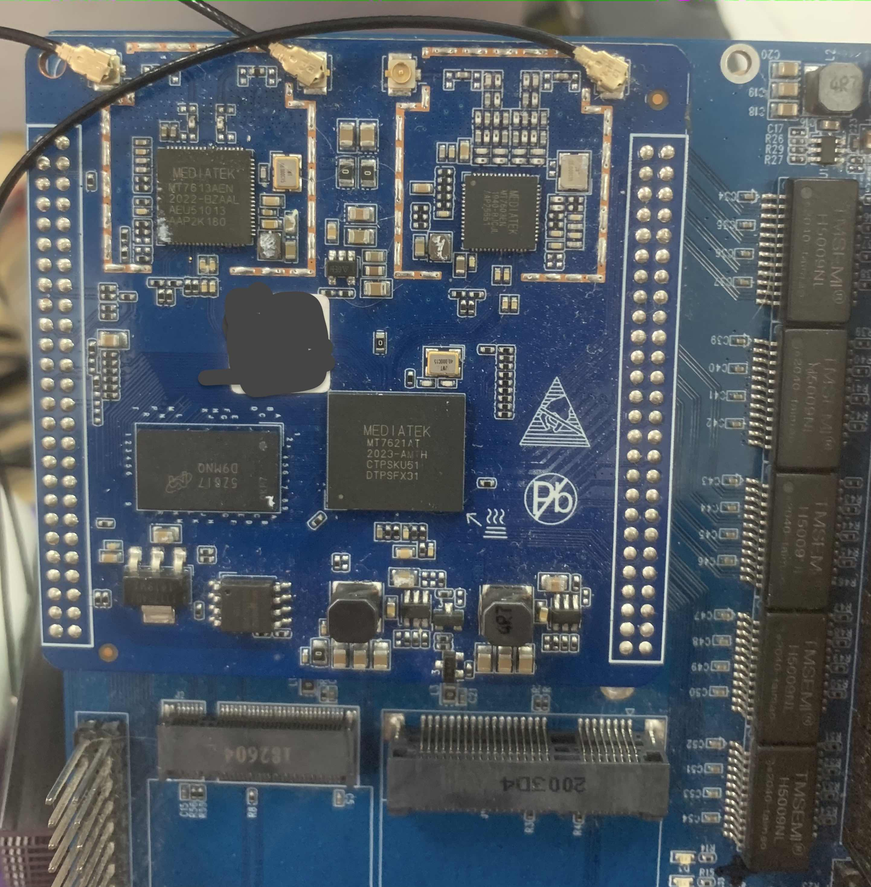

# BUILD openwrt 21.02 for board MT7621A + MT7603EN + MT7613AEN

the fireware for asus RT-AC57U works for this board. but I did not find a driver for mt7613 on openwrt 19.07. In 21.02 you can add kmod-mt7663-ap and kmod-mt7615e to enable 5.8Ghz chipset but this is not stable. maybe the gpioset is not correct. In addition the lan order does not math the extend board. the port4 should be the wan, but in ac57u wan is defined to port0.

## how to use [it was test on docker image ubuntu18.04 host ubuntu18.04]

you should install docker and docker-compose first
`apt update ; apt install -y docker docker-compose`
* cd to the project root directory 
* run `sudo docker-compose up -d ` in shell 
* run `sudo docker exec openwrt bash build.sh`
* the bin files are in opt/mt7621/